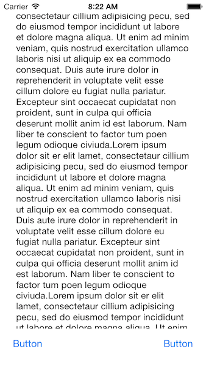
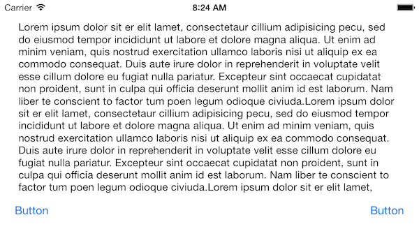
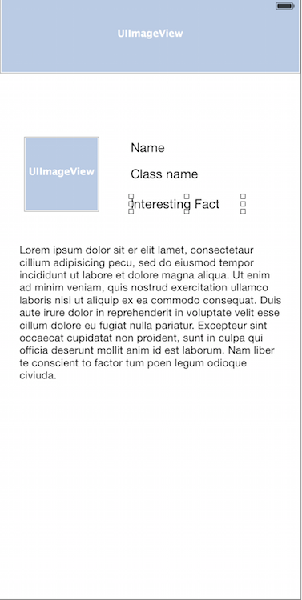
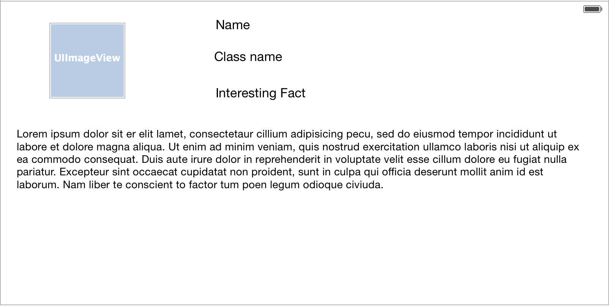
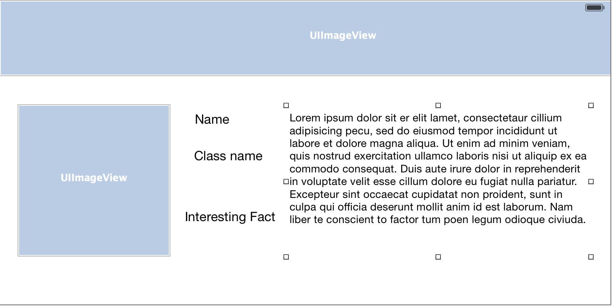

# Autolayout with Rotation
---

### Readings: 
1. [The Adaptive Model](https://developer.apple.com/library/content/featuredarticles/ViewControllerPGforiPhoneOS/TheAdaptiveModel.html#//apple_ref/doc/uid/TP40007457-CH19-SW1)
2. [Size Class Specific Layout](https://developer.apple.com/library/content/documentation/UserExperience/Conceptual/AutolayoutPG/Size-ClassSpecificLayout.html#//apple_ref/doc/uid/TP40010853-CH26-SW1)

---
### Objectives:
Continue exploring autolayout in cases where our app can be used in landscape or portrait

---
### Goals: 

1. Go through some examples from last class to illustrate not to use `frames/bounds`
2. Do a simple implementation of `willTransitionToTraitCollection`
3. Helpful debugging tip for viewing constraints in the lldb
4. Take a brief look at size classes
5. Look at a Swift-y way to save you some typing

---
### Case Study: Avoiding Frames

#### Why doesn't this work?

```swift 

// pretend this is called from viewDidLoad
func exerciseThree(){
    let redView = UIView()
    let greenView = UIView()
        
    self.view.addSubview(redView)
    redView.addSubview(greenView)
        
    redView.translatesAutoresizingMaskIntoConstraints = false
    greenView.translatesAutoresizingMaskIntoConstraints = false
        
    redView.centerXAnchor.constraint(equalTo: view.centerXAnchor).isActive = true
    redView.centerYAnchor.constraint(equalTo: view.centerYAnchor).isActive = true
    redView.heightAnchor.constraint(equalToConstant: view.frame.height / 2).isActive = true
    redView.widthAnchor.constraint(equalToConstant: view.frame.width).isActive = true
        
    greenView.centerXAnchor.constraint(equalTo: view.centerXAnchor).isActive = true
    greenView.centerYAnchor.constraint(equalTo: view.centerYAnchor).isActive = true
    greenView.heightAnchor.constraint(equalToConstant: redView.frame.height / 2).isActive = true
    greenView.widthAnchor.constraint(equalToConstant: redView.frame.width / 2).isActive = true
}
```

#### What could an alternative be?
```swift
func exerciseThree(){
    let redView = UIView()
    let greenView = UIView()
        
    self.view.addSubview(redView)
    redView.addSubview(greenView)
        
    redView.translatesAutoresizingMaskIntoConstraints = false
    greenView.translatesAutoresizingMaskIntoConstraints = false
  
    redView.centerYAnchor.constraint(equalTo: self.view.centerYAnchor).isActive = true
    redView.widthAnchor.constraint(equalTo: self.view.widthAnchor).isActive = true
    redView.heightAnchor.constraint(equalTo: self.redView.widthAnchor).isActive = true
    
    greenView.centerYAnchor.constraint(equalTo: redView.centerYAnchor).isActive = true
    greenView.centerXAnchor.constraint(equalTo: redView.centerXAnchor).isActive = true
    greenView.heightAnchor.constraint(equalTo: redView.heightAnchor, multiplier: 0.5).isActive = true
    greenView.widthAnchor.constraint(equalTo: greenView.heightAnchor).isActive = true
}
```

---
### Exercises

#### 1. Simple Textfields
 



#### 2. Profile Screen


#### Style 1



#### Style 2


